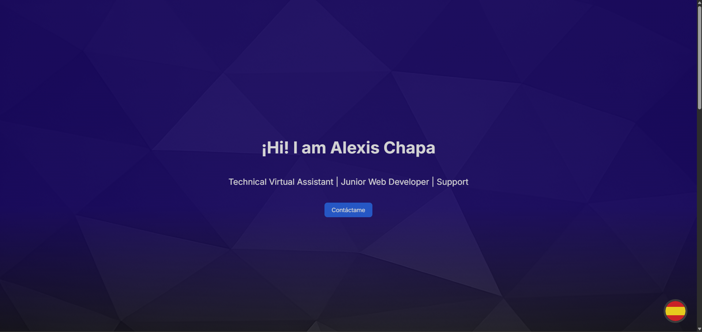

# 🌐 Personal Web Portfolio

This is a modern, responsive web portfolio developed with **HTML**, **CSS** and **pure JavaScript**, designed to showcase my projects, skills and facilitate professional contact.

 

---

## 🧩 Characteristics

- **Responsive** design adapted to mobile and desktop devices.
- **Projects** section with a "View Project" button that opens an **interactive modal**.
- Modal includes an **image carousel** and a detailed description.
- **Smooth animations** when loading the page, opening modals, or pressing buttons.
- Floating button to **switch languages** between Spanish 🇪🇸 and English 🇺🇸.

---

## 🚀 Live view

🔗 [See demo on GitHub Pages]([https://tuusuario.github.io/portafolio-web/](https://shapax99.github.io/Mi-Portafolio---My-Portfolio/Portafolio/index_EN.html))  
🔗 [View on GitHub]([https://github.com/tuusuario/portafolio-web](https://github.com/Shapax99/Mi-Portafolio---My-Portfolio))
